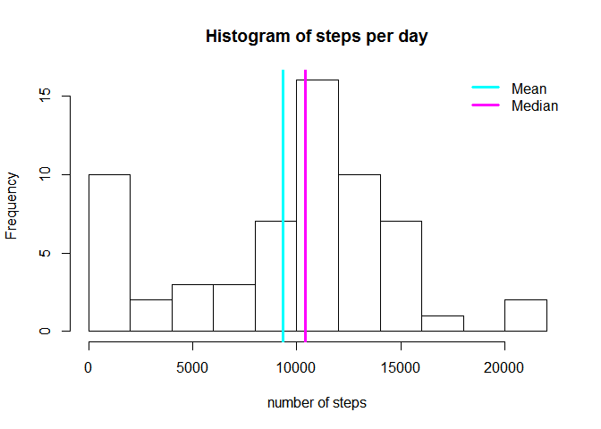
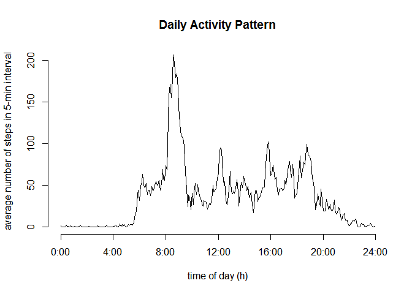
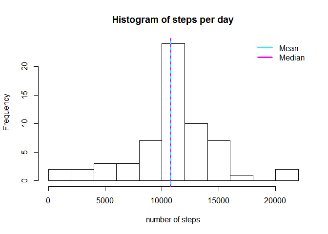
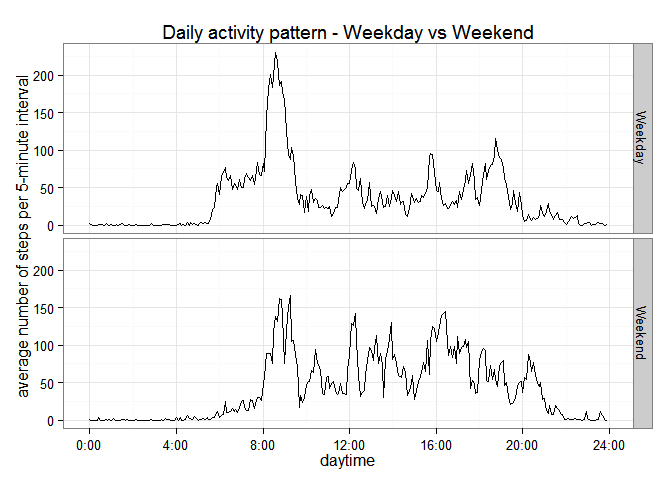

# Reproducible Research: Peer Assessment 1

## Loading and preprocessing the data

Set WD

```r
setwd("~/R/Coursera/05 Rep/Assignment1")
```

Read CSV

```r
data <- read.csv(unz("activity.zip", "activity.csv"), colClasses=c("integer", "Date", "integer"))
data$interval <- 60*floor((data$interval+1)/100) + (data$interval %% 100)
str(data)
```

```
## 'data.frame':	17568 obs. of  3 variables:
##  $ steps   : int  NA NA NA NA NA NA NA NA NA NA ...
##  $ date    : Date, format: "2012-10-01" "2012-10-01" ...
##  $ interval: num  0 5 10 15 20 25 30 35 40 45 ...
```

```r
summary(data)
```

```
##      steps             date               interval     
##  Min.   :  0.00   Min.   :2012-10-01   Min.   :   0.0  
##  1st Qu.:  0.00   1st Qu.:2012-10-16   1st Qu.: 358.8  
##  Median :  0.00   Median :2012-10-31   Median : 717.5  
##  Mean   : 37.38   Mean   :2012-10-31   Mean   : 717.5  
##  3rd Qu.: 12.00   3rd Qu.:2012-11-15   3rd Qu.:1076.2  
##  Max.   :806.00   Max.   :2012-11-30   Max.   :1435.0  
##  NA's   :2304
```

## What is mean total number of steps taken per day?
Average number of steps per day

```r
step_daily_sum <- tapply(data$steps, data$date, sum, na.rm=T)
step_mean <- mean(step_daily_sum)
step_mean
```

```
## [1] 9354.23
```
Median number of steps per day

```r
step_median <- median(step_daily_sum)
step_median
```

```
## [1] 10395
```
Histogramm Median vs. Mean


```r
hist(step_daily_sum, breaks=11, 
     xlab="number of steps", 
     main="Histogram of steps per day")
abline(v=step_mean, col="cyan", lwd=3)
abline(v=step_median, col="magenta", lwd=3)
legend(x="topright", legend=c("Mean","Median"), col=c("cyan","magenta"), bty="n", lwd=3)
```

 


## What is the average daily activity pattern?

```r
step_avg <- tapply(data$steps, data$interval, mean, na.rm=T)

hours <- as.numeric(names(step_avg))/60
plot(hours, step_avg, type="l", axes=F,
     xlab="time of day (h)", ylab="average number of steps in 5-min interval",
     main="Daily Activity Pattern")
axis(2)
axis(1, at=0:6*4, labels=paste(0:6*4,":00", sep=""))
```

 

interval with max number of steps

```r
maxact <- which(step_avg==max(step_avg))
maxint <- data$interval[maxact]
sprintf("%02d:%02d", floor(maxint/60), maxint %% 60)
```

```
## [1] "08:35"
```

## Imputing missing values
Number of NAs

```r
sum(is.na(data))
```

```
## [1] 2304
```
Impute

```r
impute <- transform(data, steps=ifelse(is.na(steps), step_avg, steps))

summary(impute)
```

```
##      steps             date               interval     
##  Min.   :  0.00   Min.   :2012-10-01   Min.   :   0.0  
##  1st Qu.:  0.00   1st Qu.:2012-10-16   1st Qu.: 358.8  
##  Median :  0.00   Median :2012-10-31   Median : 717.5  
##  Mean   : 37.38   Mean   :2012-10-31   Mean   : 717.5  
##  3rd Qu.: 27.00   3rd Qu.:2012-11-15   3rd Qu.:1076.2  
##  Max.   :806.00   Max.   :2012-11-30   Max.   :1435.0
```


```r
total_impsteps <- tapply(impute$steps, impute$date, sum, na.rm=T)

impstep_mean <- mean(total_impsteps)
impstep_mean
```

```
## [1] 10766.19
```

```r
impstep_median <- median(total_impsteps)
impstep_median
```

```
## [1] 10766.19
```

Histogram

```r
hist(total_impsteps, breaks=11, 
     xlab="number of steps", 
     main="Histogram of steps per day")
abline(v=impstep_mean, col="cyan", lwd=3,lty=1)
abline(v=impstep_median, col="magenta", lwd=3,lty=3)
legend(x="topright", legend=c("Mean","Median"), col=c("cyan","magenta"), bty="n", lwd=3)
```

 

## Are there differences in activity patterns between weekdays and weekends?

```r
Sys.setlocale("LC_TIME", "English")
```

```
## [1] "English_United States.1252"
```

```r
week <- factor(weekdays(impute$date) %in% c("Saturday","Sunday"), 
               labels=c("Weekday","Weekend"), ordered=FALSE)

step_imp <- aggregate(impute$steps, by=list(interval=impute$interval, weekday=week), mean)

library(ggplot2)
```

```
## Warning: package 'ggplot2' was built under R version 3.1.1
```

```r
g <- ggplot(step_imp, aes(interval/60, x))
g + geom_line() + facet_grid(weekday ~ .) +
    scale_x_continuous(breaks=0:6*4, labels=paste(0:6*4,":00", sep="")) +
    theme_bw() +
    labs(y="average number of steps per 5-minute interval") +
    labs(x="daytime") +
    labs(title="Daily activity pattern - Weekday vs Weekend")
```

 

